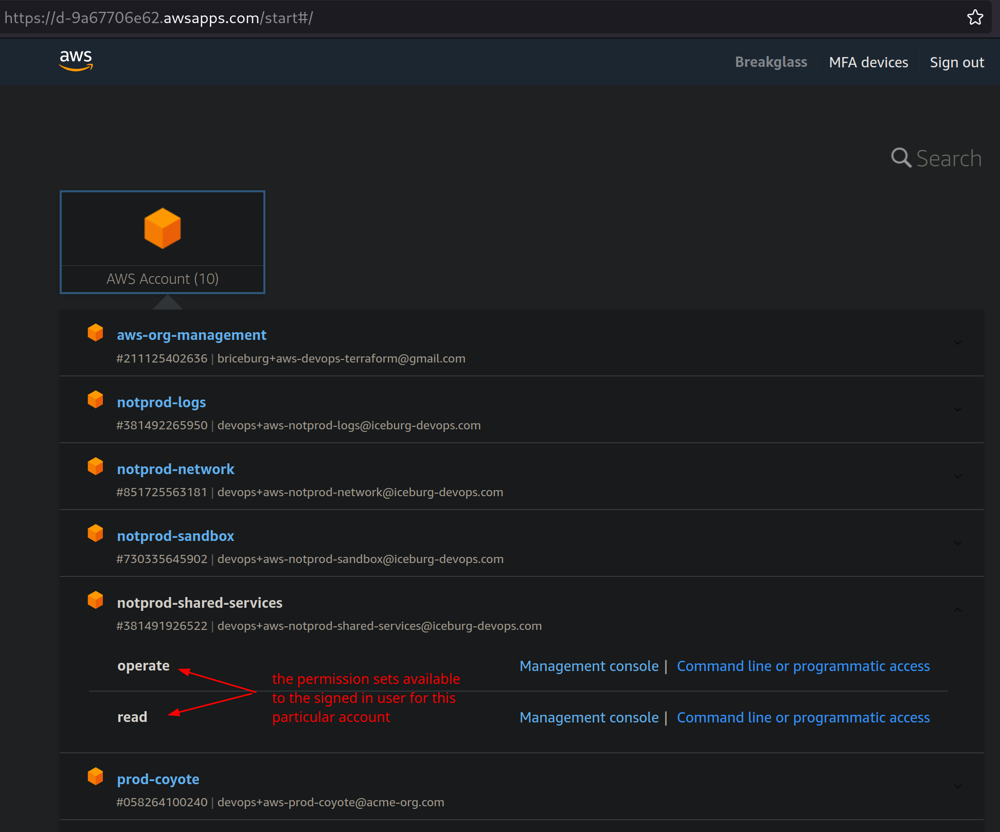

# permissions

Manages Permission Sets and Service Control Policies (SCPs) across organizations.

## Usage

Customize [main.tf](./main.tf) to your needs.

```sh
terraform init
terraform apply
```

### Permission Sets

Permission Sets define what a user has access to within an assigned account through attached policies. They are also known as "roles", and are selectable by sso users  from the AWS "start" portal.

Three permission sets are provided as a basic example -- `admin`, `operate`, and `read` -- which are arbitrarily named and can be customized as needed through the [permission_sets module](./modules/aws-permission-sets/);

```terraform
permission_sets = {
  admin   = "Read/Write Access to all resources."
  operate = "Operate Access to terraformed resources."
  read    = "Read Access to terraformed resources."
}

permission_set_policies = {
  admin = {
    managed = [
      "arn:aws:iam::aws:policy/AdministratorAccess"
    ]
  }
  ...
}
```



### Permission Set Assignment

Permission Sets are assigned to individual accounts along with associated group(s). If a user belongs to an associated group, they are able to access the account using the Permission Set "role". 

> Manage users and groups via the [users-and-groups terraform](../users-and-groups/).

The [permission_set_assignments module](./modules/aws-permission-set-assignments/) supports three methods for assigning permission sets to accounts. This should provide the flexibility to accommodate many organizational topographies.


#### By Membership

Assign permission sets based on account membership. This is a convenient method for bulk assignment, e.g. to assign a permission set to all accounts within a particular organization or tier.

Membership is matched against an account's `org`, `tier`, and `ou`. The [accounts terraform](../accounts/) outputs a map of accounts detailing their membership. E.g.

```terraform
accounts = {
  "058264100240" = {
    "name" = "prod-coyote"
    "org" = "acme"
    "ou" = "workloads"
    "tier" = "prod"
  }
  "381491926522" = {
    "name" = "notprod-shared-services"
    "org" = "iceburg-devops"
    "ou" = "infrastructure"
    "tier" = "notprod"
  }
  ...
}
```

 accepts a `by_membership` list allowing you to match against these properties. If a property is not provided, it is equivalent of a wildcard and will match any value for that property. Example matching;

```terraform

by_membership = [
  {
    # no selectors will match all accounts in every sub-organization.
    perms = [
      {
        groups          = ["admin"]
        permission_sets = ["admin"]
      },
      {
        groups          = ["prodeng"]
        permission_sets = ["operate", "read"]
      },
      ...
    ]
  },
  {
    # match all accounts in the 'acme' sub-organization.
    orgs = ["acme"]
    perms = ...
  },
  {
    # match all accounts within the 'notprod' tier of every sub-organization.
    tiers = ["notprod"]
    perms = ...
  },
  {
    # match all accounts in the 'security' OU of every sub-organization.
    ous = ["security"]
    perms = ...
  },
  {
    # match all accounts in the 'workloads' OU within the 'prod' tier of every sub-organization.
    tiers = ["prod"]
    ous   = ["workloads"]
    perms = ...
  },
]
```

#### By Account or By Group

Permission sets can also be assigned per account (`by_accounts`) or per user group (`by_groups`). Examples;

```terraform
by_accounts = [
  {
    accounts = ["prod-coyote"]
    perms = ...
  }
]

by_groups = [
  {
    groups = ["engineer"]
    perms = ...
  }
]
```

### Service Control Policies (SCPs)

TODO: docs. Assignments are similar to by_membership permission set assigninment, however SCPs target OUs instead of accounts.

```
#
# service control policies - attach to an OU and effect descendent accounts.
# https://docs.aws.amazon.com/organizations/latest/userguide/orgs_manage_policies_scps_syntax.html
# https://aws.amazon.com/blogs/security/how-to-control-access-to-aws-resources-based-on-aws-account-ou-or-organization/
# https://aws.amazon.com/blogs/security/iam-share-aws-resources-groups-aws-accounts-aws-organizations/
#
```


